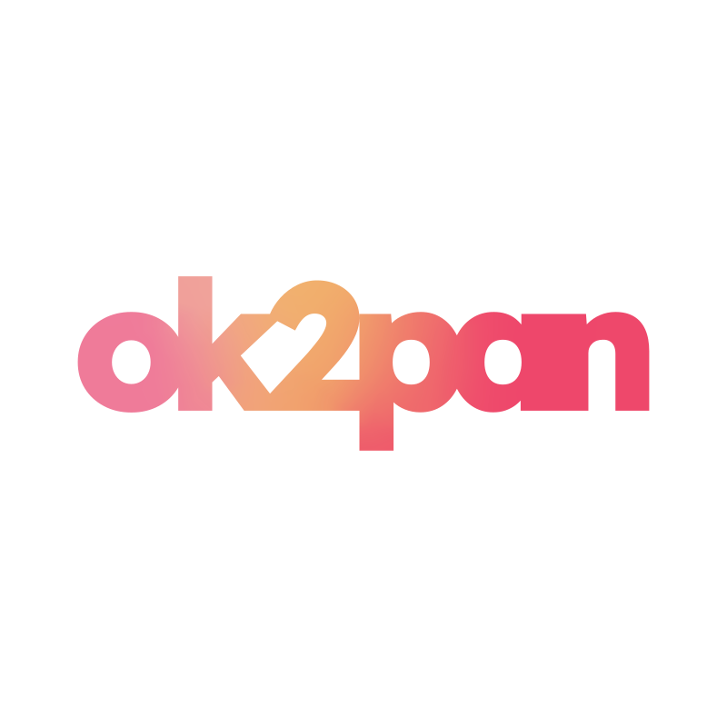

<div align="center">
  
</div>

# OK2PAN

OKLCH to Pantone color converter using professional-grade color matching algorithms.

## What is OKLCH?

OKLCH is a modern perceptually uniform color space designed for digital displays. It represents colors using Lightness, Chroma, and Hue in a way that matches human color perception. OKLCH excels at creating smooth gradients, maintaining consistent brightness across hues, and representing colors that modern wide-gamut displays can produce.

**Use Cases:** Web design, UI/UX, digital art, CSS color definitions, screen-based color manipulation.

## What is Pantone?

Pantone is a standardized color matching system used primarily in physical printing and manufacturing. Each Pantone color is defined by a specific ink formulation, ensuring consistent reproduction across different materials and print processes. Pantone colors are referenced by unique codes (e.g., PANTONE 485 C).

**Use Cases:** Print design, branding materials, product manufacturing, textile design, packaging.

## The Difference

OKLCH is digital and perceptually uniform for screens. Pantone is physical with standardized ink formulations for print. OKLCH offers more flexibility for screen colors, while Pantone ensures consistency across physical media. Converting between them bridges the digital-to-physical color workflow.

## Perceptual Harmony

Both OKLCH and Pantone are fundamentally designed around human color perception, making them compatible despite their different applications. OKLCH's perceptual uniformity means equal numerical distances represent equal perceptual differences to the human eye. Pantone's LAB-based definitions follow the same principle, where colors are specified by how humans perceive them rather than by technical measurements. This shared perceptual foundation allows accurate conversion between the two systems. When OKLCH lightness increases by a fixed amount, the human eye perceives a consistent brightness change, just as equal DeltaE differences in Pantone LAB values represent equal perceived color differences. This perceptual alignment enables professional-grade color matching across digital and physical media.

## How Color Matching Works

The system uses a hybrid dual-algorithm approach for maximum accuracy:

**Phase 1 - Fast Filter:** OKLab Euclidean distance rapidly filters 2,369 Pantone colors to the top 50 candidates. OKLab's perceptual uniformity allows simple distance calculations while maintaining 90-95% accuracy.

**Phase 2 - Precise Ranking:** CIEDE2000 (DeltaE 2000) refines the top candidates using the industry-standard formula. This algorithm accounts for known perceptual non-uniformities in color spaces, particularly in blues and neutral tones, ensuring professional-grade accuracy.

**Phase 3 - Quality Classification:** Matches are classified using ISO standards: Excellent (ΔE ≤ 1), Good (ΔE ≤ 2), Acceptable (ΔE ≤ 3), Fair (ΔE ≤ 5), Poor (ΔE > 5).

The ΔE (Delta E) value represents perceptual color difference. A ΔE of 2-3 is the professional printing standard, meaning the colors are nearly indistinguishable to most observers.

## Tech Stack

- React 19 + Vite
- Culori (color conversion and DeltaE 2000)
- Tailwind CSS 4
- HeroUI Components

## Installation

```bash
cd pantone-app
npm install
npm run dev
```

## License

MIT
